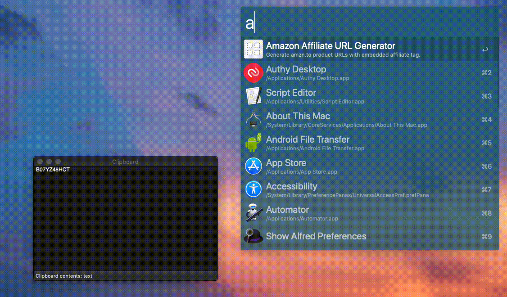

# Amazon Affiliate Short URL Generator

An Alfred workflow which takes an [Amazon ASIN](https://en.wikipedia.org/wiki/Amazon_Standard_Identification_Number) and generates a shortened URL (`amzn.to`) including your affiliate tag.

    
    

# How to
## Install
1. Download the latest `.alfredworkflow` file from the [releases section](https://github.com/tigattack/AmznAffiliateURL-Alfred-Workflow/releases).
2. Double click the downloaded file to add the workflow to Alfred.

## Configure
1. Open the [workflow environment variables panel](https://www.alfredapp.com/help/workflows/advanced/variables/#environment).
2. Add your [bit.ly API token](https://bitly.is/accesstoken), [Amazon Associate tracking ID](https://affiliate-program.amazon.co.uk/home/account/tag/manage), and [regional Amazon domain](https://en.wikipedia.org/wiki/Amazon_(company)#Website) to the relevant variables.

## Use
1. Trigger Alfred using your configured shortcut.
2. Type `amzn `, append an Amazon product ASIN, and hit enter.
3. Find the shortened URL including affiliate tag in your clipboard.

# Notices

This Alfred Workflow is not affiliated in any way with Amazon or bit.ly.

Released under the [MIT license](https://tldrlegal.com/license/mit-license).
